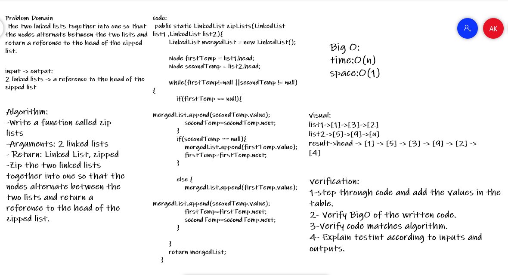

## challenge 5 
Linked List Implementation
Features
Node
Create a Node class that has properties for the value stored in the Node, and a pointer to the next Node.
Linked List
Create a Linked List class
Within your Linked List class, include a head property.
Upon instantiation, an empty Linked List should be created.
The class should contain the following methods
insert
**Arguments**: value
**Returns**: nothing
Adds a new node with that value to the head of the list with an O(1) Time performance.
includes
**Arguments**: value
**Returns**: Boolean
Indicates whether that value exists as a Node’s value somewhere within the list.
to string
**Arguments**: none
**Returns**: a string representing all the values in the Linked List, formatted as:
"{ a } -> { b } -> { c } -> NULL"

## challenge 7
return the node's value that is k places from the 
tail of the linked list 
-argument: a number, k, as a parameter.
-Return the node’s value that is k places from the tail of the linked list.

## challenge 8
Write a function called zip lists
**Arguments**: 2 linked lists
**Return**: Linked List, zipped as noted below
Zip the two linked lists together into one so that the nodes alternate between the two lists and return a reference to the head of the zipped list.

