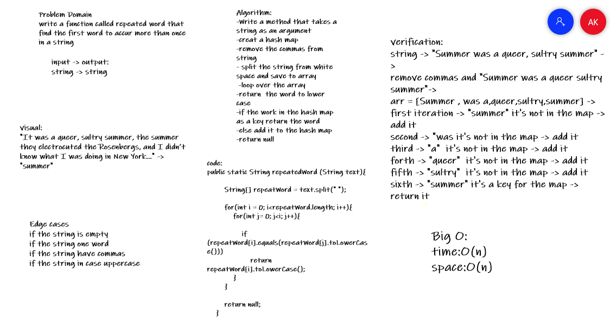
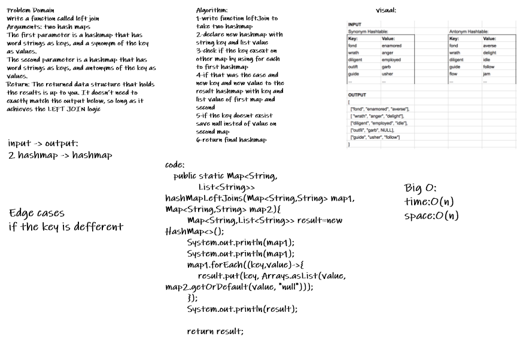

# Implement a Hashtable Class with the following methods:

## add
Arguments: key, value
Returns: nothing
This method should hash the key, and add the key and value pair to the table, handling collisions as needed.

## get
Arguments: key
Returns: Value associated with that key in the table

## contains
Arguments: key
Returns: Boolean, indicating if the key exists in the table already.

## hash
Arguments: key
Returns: Index in the collection for that key

# code challenge 31 
## Write a function called repeated word that finds the first word to occur more than once in a string
Arguments: string
Return: string

# code challenge 33 
## Write a function that LEFT JOINs two hashmaps into a single data structure.

Write a function called left join
Arguments: two hash maps
The first parameter is a hashmap that has word strings as keys, and a synonym of the key as values.
The second parameter is a hashmap that has word strings as keys, and antonyms of the key as values.
Return: The returned data structure that holds the results is up to you. It doesn’t need to exactly match the output below, so long as it achieves the LEFT JOIN logic

