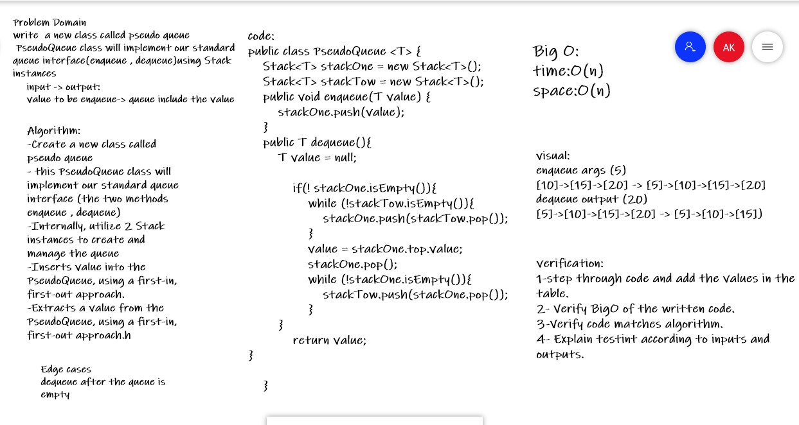
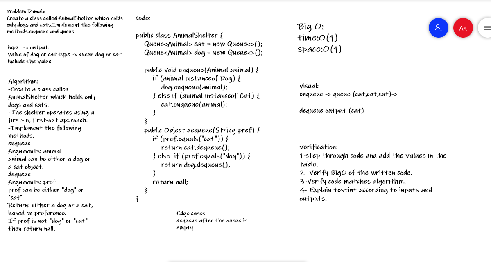

## Stack and a Queue Implementation
*Features*
Using a Linked List as the underlying data storage mechanism, implement both a Stack and a Queue

### Node
Create a Node class that has properties for the value stored in the Node, and a pointer to the next node.
## Stack
Create a Stack class that has a top property. It creates an empty Stack when instantiated.
This object should be aware of a default empty value assigned to top when the stack is created.
The class should contain the following methods:
### push
Arguments: value
adds a new node with that value to the top of the stack with an O(1) Time performance.
### pop
Arguments: none
Returns: the value from node from the top of the stack
Removes the node from the top of the stack
Should raise exception when called on empty stack
### peek
Arguments: none
Returns: Value of the node located at the top of the stack
Should raise exception when called on empty stack
### is empty
Arguments: none
Returns: Boolean indicating whether or not the stack is empty.
## Queue
Create a Queue class that has a front property. It creates an empty Queue when instantiated.
This object should be aware of a default empty value assigned to front when the queue is created.
The class should contain the following methods:
### enqueue
Arguments: value
adds a new node with that value to the back of the queue with an O(1) Time performance.
### dequeue
Arguments: none
Returns: the value from node from the front of the queue
Removes the node from the front of the queue
Should raise exception when called on empty queue
### peek
Arguments: none
Returns: Value of the node located at the front of the queue
Should raise exception when called on empty stack
### is empty
Arguments: none
Returns: Boolean indicating whether or not the queue is empty

## codechallenge 11
### Create a new class called pseudo queue.
Do not use an existing Queue.
Instead, this PseudoQueue class will implement our standard queue interface (the two methods listed below),
Internally, utilize 2 Stack instances to create and manage the queue
### Methods:
#### enqueue
Arguments: value
Inserts value into the PseudoQueue, using a first-in, first-out approach.
#### dequeue
Arguments: none
Extracts a value from the PseudoQueue, using a first-in, first-out approach.

## codechallenge 12
### Create a class called AnimalShelter which holds only dogs and cats.
The shelter operates using a first-in, first-out approach.
### Implement the following methods:
#### enqueue
Arguments: animal
animal can be either a dog or a cat object.
#### dequeue
Arguments: pref
pref can be either "dog" or "cat"
Return: either a dog or a cat, based on preference.
If pref is not "dog" or "cat" then return null.

