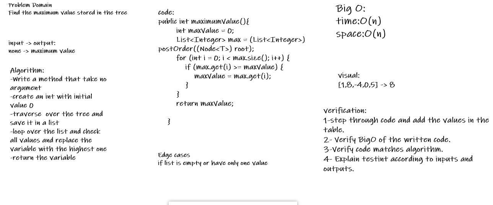

# Binary Tree and BST Implementation
## Node
Create a Node class that has properties for the value stored in the node, the left child node, and the right child node.
Binary Tree
## Create a Binary Tree class
Define a method for each of the depth first traversals:
pre order
in order
post order which returns an array of the values, ordered appropriately.

## Binary Search Tree
Create a Binary Search Tree class
This class should be a sub-class (or your languages equivalent) of the Binary Tree Class, with the following additional methods:
### Add
Arguments: value
Return: nothing
Adds a new node with that value in the correct location in the binary search tree.
### Contains
Argument: value
Returns: boolean indicating whether or not the value is in the tree at least once.

#code challenge 16
## Write the following method for the Binary Tree class

find maximum value
Arguments: none
Returns: number
Find the maximum value stored in the tree. You can assume that the values stored in the Binary Tree will be numeric.

